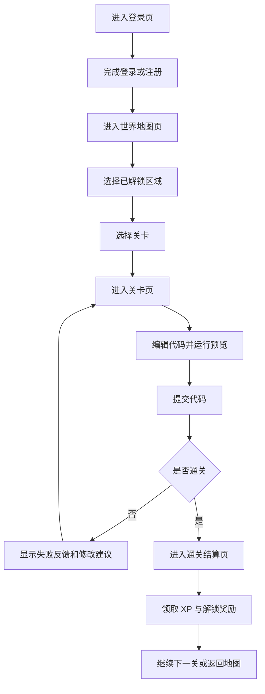

## 1. 产品概述
`WebQuest` 前端模块是一个以 RPG 游戏化体验为核心的 Web 学习界面系统，负责承载地图探索、关卡挑战、在线编码、成长反馈等核心交互。
- 目标用户是 Web 开发初学者、课程项目开发者和需要沉浸式学习体验的编程入门用户
- 前端需要将“学习路径”转化为“冒险式体验”，提升持续学习动力与产品展示效果

## 2. 核心功能

### 2.1 用户角色
| 角色 | 注册方式 | 核心权限 |
|------|----------|----------|
| 普通用户 | 用户名注册 | 登录、查看地图、进入关卡、提交代码、查看成长进度 |

### 2.2 功能模块
1. **登录页**：品牌展示、账号登录、注册入口、快速开始引导
2. **世界地图页**：区域地图、解锁状态、用户等级与 XP、当前挑战入口
3. **关卡页**：剧情任务、代码编辑器、运行预览、提交反馈
4. **通关结算页**：评分结果、XP 奖励、等级变化、下一关引导

### 2.3 页面详细说明
| 页面名称 | 模块名称 | 功能描述 |
|-----------|-------------|---------------------|
| 登录页 | 品牌区 | 展示 WebQuest 世界观、产品价值和沉浸式入口 |
| 登录页 | 登录表单 | 支持用户名密码登录，失败提示清晰 |
| 登录页 | 注册入口 | 支持切换注册模式，首版使用同页切换 |
| 世界地图页 | 用户信息条 | 展示用户名、等级、XP、当前进度 |
| 世界地图页 | 世界地图主视觉 | 用游戏区域形式展示 HTML、CSS、JS 三个核心区域 |
| 世界地图页 | 区域状态卡 | 展示区域名称、解锁状态、推荐关卡数量 |
| 世界地图页 | 关卡入口浮层 | 点击区域后显示可进入关卡列表 |
| 关卡页 | 剧情任务区 | 展示关卡背景、目标、提示、奖励 XP |
| 关卡页 | 代码编辑区 | 支持 HTML/CSS/JS 三栏编辑或切换编辑 |
| 关卡页 | 实时预览区 | 通过 iframe 沙箱展示运行结果 |
| 关卡页 | 操作区 | 支持运行、重置、提交、返回地图 |
| 关卡页 | 反馈区 | 展示成功/失败、得分、缺失项提示 |
| 通关结算页 | 结算主卡片 | 展示星级、XP、等级变化和通关文案 |
| 通关结算页 | 解锁提示区 | 展示新关卡/新区域解锁结果 |
| 通关结算页 | 下一步操作 | 支持继续挑战或返回地图 |

## 3. 核心流程
主流程为：用户进入登录页 -> 登录成功 -> 进入世界地图 -> 选择已解锁区域和关卡 -> 在关卡页完成代码编辑、运行和提交 -> 提交成功后进入结算页 -> 获取 XP 并引导进入下一关或返回地图。

## 4. 用户界面设计

### 4.1 设计风格
- 主色：深夜蓝、森林绿、闪电青，形成游戏世界分区感
- 强调色：金色 XP 奖励、霓虹青交互高亮、橙红失败提示
- 按钮风格：厚重卡牌式按钮，轻微 3D 浮起感和发光边框
- 字体风格：标题采用具有奇幻冒险感的展示字体，正文字体采用清晰现代无衬线字体
- 布局风格：桌面优先，采用大视野游戏面板布局与卡片式信息分区
- 图标风格：地图徽章、技能符号、卷轴任务图标、像素与幻想混合风格

### 4.2 页面设计概览
| 页面名称 | 模块名称 | UI 元素 |
|-----------|-------------|-------------|
| 登录页 | 品牌区 | 大标题、世界观副标题、渐变背景、轻粒子装饰 |
| 登录页 | 表单卡片 | 毛玻璃卡片、输入高亮、模式切换按钮 |
| 世界地图页 | 地图主画布 | 区域节点、路径连线、区域发光状态、解锁动画 |
| 世界地图页 | 进度条 | XP 进度条、等级徽章、当前任务提示 |
| 关卡页 | 剧情区 | 卷轴式任务卡、目标标签、奖励徽章 |
| 关卡页 | 编辑器区 | 深色代码面板、标签切换、运行按钮 |
| 关卡页 | 预览区 | 浏览器窗口风格容器、运行结果沙箱 |
| 通关结算页 | 结果主卡 | 发光边框、星级评分、XP 数字跳动动画 |
| 通关结算页 | 解锁区 | 新关卡卡片、地图节点点亮动效 |

### 4.3 响应式策略
- 采用桌面优先设计
- 平板下保留三栏核心结构，但压缩间距和控件尺寸
- 移动端采用堆叠布局：剧情区 -> 编辑区 -> 预览区
- 登录页和结算页优先保证移动端可用
- 地图页在移动端简化为纵向章节视图或可拖拽地图视图

