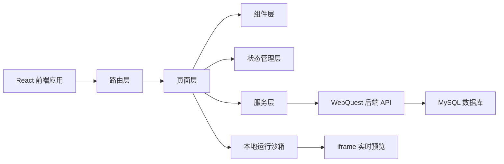
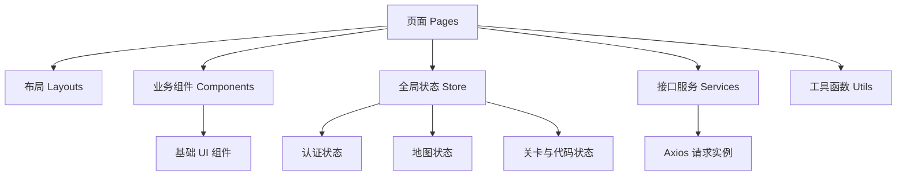
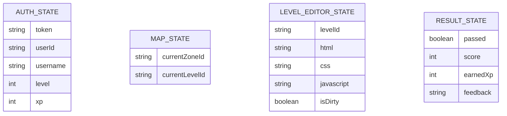

## 1. 架构设计



## 2. 技术说明
- 前端框架：`React 18 + TypeScript + Vite`
- 样式方案：`Tailwind CSS 3`
- 路由方案：`React Router 6`
- 状态管理：`Zustand`
- 网络请求：`Axios`
- 代码编辑器：`Monaco Editor`
- 运行预览：`iframe sandbox`
- 图标方案：`Lucide React`
- 动画方案：`Framer Motion`
- 初始化工具：`Vite`

## 3. 路由定义
| 路由 | 用途 |
|------|------|
| `/` | 登录页与注册入口 |
| `/map` | 世界地图页，展示区域、关卡入口和成长信息 |
| `/levels/:id` | 关卡页，承载剧情、编辑器、预览和提交 |
| `/result/:id` | 通关结算页，展示结果和下一步引导 |

## 4. API 定义

### 4.1 鉴权相关

```ts
type AuthPayload = {
  username: string;
  password: string;
};

type AuthUser = {
  id: string;
  username: string;
  level: number;
  xp: number;
};

type LoginResponse = {
  code: number;
  message: string;
  data: {
    token: string;
    user: AuthUser;
  };
};

type RegisterResponse = {
  code: number;
  message: string;
  data: {
    user: AuthUser;
  };
};
```

- `POST /api/auth/register`
- `POST /api/auth/login`
- `GET /api/users/profile`

### 4.2 地图与关卡相关

```ts
type Zone = {
  id: string;
  name: string;
  slug: string;
  description: string;
  requiredLevel: number;
  isUnlocked?: boolean;
};

type Level = {
  id: string;
  zoneId: string;
  title: string;
  description: string;
  difficulty: "easy" | "medium" | "hard";
  rewardXp: number;
  starterCode: {
    html: string;
    css: string;
    javascript: string;
  };
  requiredKeywords: string[];
};

type ProgressResponse = {
  code: number;
  message: string;
  data: {
    userId: string;
    currentLevel: number;
    currentXp: number;
    currentLevelId: string;
    completedLevelIds: string[];
    unlockedZoneIds: string[];
  };
};
```

- `GET /api/zones`
- `GET /api/levels`
- `GET /api/levels/:id`
- `GET /api/progress/current`

### 4.3 提交相关

```ts
type SubmissionPayload = {
  levelId: string;
  html: string;
  css: string;
  javascript: string;
};

type SubmissionResponse = {
  code: number;
  message: string;
  data: {
    submission: {
      id: string;
      userId: string;
      levelId: string;
      passed: boolean;
      score: number;
      earnedXp: number;
      submittedAt: string;
    };
    progress: {
      level: number;
      xp: number;
      completedLevelIds: string[];
    };
    feedback: string;
  };
};
```

- `POST /api/submissions`

## 5. 前端架构分层图



## 6. 数据模型

### 6.1 前端核心状态模型



### 6.2 数据定义语言

前端自身不创建业务表，但依赖后端以下核心数据库结构：
- `users`
- `zones`
- `levels`
- `user_level_progress`
- `user_completed_levels`
- `user_unlocked_zones`
- `submissions`

前端本地存储建议如下：

```text
localStorage:
- webquest_token
- webquest_user
- webquest_editor_cache_{levelId}
```

## 7. 目录规划

```text
web/
  src/
    assets/
    components/
      common/
      map/
      level/
      result/
      auth/
    layouts/
      GameLayout.tsx
      AuthLayout.tsx
    pages/
      LoginPage.tsx
      MapPage.tsx
      LevelPage.tsx
      ResultPage.tsx
    router/
      index.tsx
      guards.tsx
    services/
      api.ts
      auth.service.ts
      zones.service.ts
      levels.service.ts
      progress.service.ts
      submissions.service.ts
    store/
      auth.store.ts
      map.store.ts
      level.store.ts
    hooks/
    utils/
      sandbox.ts
      token.ts
      format.ts
    types/
      api.ts
      auth.ts
      level.ts
```

## 8. 开发约束
- 前端优先对接当前已有后端 API，不自行计算 XP 或判定通关
- 所有需要登录的页面必须通过路由守卫校验 token
- 所有页面文案和交互反馈统一中文
- 所有核心页面必须优先支持桌面端
- 在线预览区必须通过 `sandbox iframe` 隔离执行
- 编辑器内容支持本地缓存，防止刷新丢失

